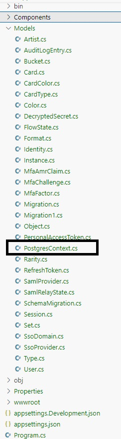

# How to use the MTG database with Entity Framework

Because the MTG database is already provided as a PostgreSQL database, you can use it with Entity Framework as a database-first approach. 

This means that you can generate the model from the database and use it in your application.

## Goal
 - Use the MTG database with Entity Framework in **vscode**.
 - Use the MTG database with Entity Framework in **Visual Studio**.

## Visual Studio Code

Follow these steps to use the MTG database with Entity Framework in vscode.

### Prerequisites
 - A working PostgreSQL MTG database.
    - Make sure you can connect to the database using a tool like datagrip.
 - A working .NET 8 project.
 - Make sure you are in the root of your .NET project.

### Install the Entity Framework tools
```bash
dotnet add package Npgsql.EntityFrameworkCore.PostgreSQL
dotnet add package Microsoft.EntityFrameworkCore.Tools
dotnet add package Microsoft.EntityFrameworkCore.Design
```

Check the `*.csproj` file to see if the packages are added.

Example:
```xml
  <ItemGroup>
    <PackageReference Include="Microsoft.EntityFrameworkCore.Design" Version="8.0.2">
      <IncludeAssets>runtime; build; native; contentfiles; analyzers; buildtransitive</IncludeAssets>
      <PrivateAssets>all</PrivateAssets>
    </PackageReference>
    <PackageReference Include="Microsoft.EntityFrameworkCore.Tools" Version="8.0.2">
      <IncludeAssets>runtime; build; native; contentfiles; analyzers; buildtransitive</IncludeAssets>
      <PrivateAssets>all</PrivateAssets>
    </PackageReference>
    <PackageReference Include="Npgsql.EntityFrameworkCore.PostgreSQL" Version="8.0.0" />
  </ItemGroup>
```
    
### Install Entity Framework

First, check the version of the installed .NET 8 SDK.
```bash	
dotnet --version
result: 8.0.101
```

Then, install the Entity Framework tools.
Specify the version of the tools to install.

**The last digit of the version number should match the last digit of the .NET 8 SDK version.**

```bash
dotnet tool install --global dotnet-ef --version 8.0.1
```

### Generate the model from the database

Run the following command to generate the model from the database.
- Replace `URL`, `USERNAME`, `DATABASE` and `PASSWORD` with the correct values.

```bash
dotnet ef dbcontext scaffold "Host=URL;Database=DATABASE;Username=USERNAME;Password=PASSWORD" Npgsql.EntityFrameworkCore.PostgreSQL -o Models
```

### Check

Check the `Models` folder to see if the model is generated.

Also verify that the `DbContext` is generated.



## Visual Studio 2022

Follow these steps to use the MTG database with Entity Framework in VS2022.

### Prerequisites
 - A working PostgreSQL MTG database.
    - Make sure you can connect to the database using a tool like datagrip.
 - A working .NET 8 project.
 - Make sure you are in the root of your .NET project.

 ### Install the Entity Framework tools (NuGet)
 - Manage NuGet packages

```bash
Npgsql.EntityFrameworkCore.PostgreSQL
Microsoft.EntityFrameworkCore.Tools
```
Check Project -> Dependencies -> Packages

### Start Package Manager Console

Tools -> NuGet Package Manager -> Package Manager Console

```bash
PM>Scaffold-DbContext "host=...;database=...;user id=...;password=..." Npgsql.EntityFrameworkCore.PostgreSQL -OutputDir Models -Context MyDBContext
```


- check Models
- check MyDBContext
